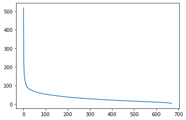
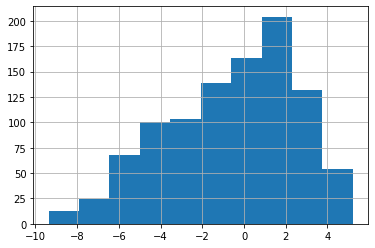

# movie-rater-project

`Pedro Antônio Silva e Gustavo Lindenberg Pacheco`

https://github.com/gustavolp1/movie-rater-project

## Como instalar e executar

> git clone 

(Entre no diretório do repositório)

> pip install -r "requirements.txt"

## Como usar o programa

Abra `demo.py` e o execute. Note que o processo inteiro pode demorar algumas horas.

Para a análise de iterações já executadas, abra `demo.ipynb`, uma versão de notebook do arquivo de demo. Os outputs das células contém resultados obtidos previamente.

## Objetivo

Criar um programa em python que use de relações matriciais e decomposição SVD para criar um sistema de predições de notas dadas a filmes.

## Modelo Matemático e Análises

Antes de começarmos a equacionar nosso sistema, precisamos tratar e gravar os dados que queremos usar - sabemos que em primeiro lugar, precisamos substituir um ou mais elementos da matriz $A_(ij)$, que contém as notas que o usuário `i` deu ao filme `j`, de 0 a 5 - o que é feito através da função `randomiza_matriz(A)`, que também retorna qual item foi alterado.

Em segundo lugar precisavamos descobrir uma forma de estimar o valor original dessa matriz $A$ modificada sem ter acesso a matriz originária. Para este fim, usamos um sistema similar ao de remoção de ruídos de imagens, devido as similaridades presentes entre a decomposição de matrizes vindas de imagems com a decomposição da matriz usada para mapear perfis.

-   # Imagem X Matriz

    As notas reais para cada filme são representadas pela matriz `A`, onde cada linha é um usuário e cada coluna é um filme. Um exemplo de um cenário onde existem 3 usuários e 4 filmes, com notas de 0 a 5:

    $$
    A =
    \begin{bmatrix}
    3 & 1.5 & 4 & 5 \\
    4 & 5 & 3 & 5 \\
    1 & 0 & 4.5 & 2
    \end{bmatrix}
    $$

    - #### Caso fosse uma matriz imagem que mapeia cores para posições x,y:
        - As linhas representariam a coordenada y da imagem e as colunas sua coordenada x, ambos em pixeis.
        - Os valores seriam uma tupla representando um valor RGB.
    
    \
    Através de uma decomposição SVD (Single Value Decomposition) da matriz A, somos capazes de obter algumas relações e visualizar similaridades:
    
    - ## Imagem:
    $$
    A_(yx) = X_(yc)Y_(cc)Z_(cx)
    $$
    - Onde:
        - `X` representa os autovetores que relacionam a coordenada y em linhas com o padrão das cores em colunas.

        - `Y` representa os autovalores e mapeia uma cor com a outra, em uma matriz quadrada, relacionando cores e registrando um padrão da imagem.

        - `Z` representa os autovetores que relacionam padrões de cores com a coordenada x.

    - ## Ratings
    $$
    A_(uf) = X_(up) Y_(pp) Z_(pf)
    $$
    - Onde:
        - `X` representa os autovetores em uma matriz de usuários por linhas e perfis por coluna.

        - `Y` representa os autovalores e mapeia um usuario com outro gerando perfis em uma matriz quadrada, relacionando um perfil a todos os outros e também registrando um padrão.

        - `Z` representa os autovetores que relacionam perfis com filmes.

    Ao observarmos a similaridade entre o mapeamento de cores com o mapeamento de perfis, partimos para a resolução do problema: 

  
Como estimar um valor a partir de um dado errado/desconhecido para obtermos algo mais próximo do real?

- # Remoção de Ruídos
Levando em conta esta equação:
$$
A_(yx) = X_(yc)Y_(cc)Z_(cx)
$$
Quando tratamos da decomposição SVD de uma imagem, ao zerarmos alguns valores menos relevantes da matriz de auto-valores `Y` e reconstruir a imagem a partir dessa matriz modificada e as matrizes `X` e `Z` da mesma, realizamos um processo conhecido como remoção de ruídos.

Este processo, por remover valores menos relevantes, acaba generalizando a matriz para os padrões definidos pelas relações entre os autovetores e autovalores mais relevantes, normalizando a cor para ser similar a das redondezas.

Com esse comportamento registrado, podemos então realizar o mesmo processo com a matriz de ratings e verificar se esta relação também se aplica para usuarios,perfis e filmes.

- # Resultados e Metodologias de Teste

Após a decomposição de nossa matriz de ratings modificada, precisamos encontrar quais autovalores são menos relevantes para sua composição, ou seja, quais são menores.

Para fazer isso, optamos por uma abordagem visual, em que buscamos o ponto em que os autovalores se tornam menores:

-   ### Escolha do corte:
    decidimos estabelecer nosso corte de autovalores em 200, visto que ao observarmos o gráfico percebemos que os auto-valores e auto-vetores relacionados além dos 200 primeiros têm pouca relevância para a estimativa final, visto que cobrem uma area aparente menor do gráfico.\
\
Com o corte definido, basta reconstruir a matriz a partir da decomposição SVD da seguinte forma:

$$
    A_e = X Y_mZ
$$
-   Esta reconstrução ocorre na função `estima_valor(X,Y,Z,corte)`

Com:

- $A_e$ sendo a matriz reconstruida.
- `X` autovetores de usuários por perfil obtidos da matriz modificada.
- `Y_m` uma matriz diagonal contendo os 200 primeiros autovalores.
- e `Z` os autovalores de perfis por filmes.

Agora que realizamos esta reconstrução, podemos então subtrair o valor estimado em $A_e$ do valor original em $A$, obtendo o 'erro' resultante de nosso programa - fazendo este processo varias vezes, no nosso caso mil, obteremos um dataset de erros que representará bem a precisão das estimativas. Segue um histograma deste dataset.

# Conclusão

Com a visualização dos dados gerados por nosso processo de estimativas, foi possivel entendermos melhor pontos em que nosso sistema precisa de ajustes e pontos em que ele funciona como esperado por nossa teoria.

- De imediato, podemos observar um erro que precisa de concerto: nosso programa gerou erros de até -11 (aproximado) o que claramente não se alinha com o padrão de pontuação de 0 a 5 de nosso dataset.

- Apesar dessa ocorrência, é possível também verificar qu nosso sistema se aproxima consideravelmente do valor esperado com mais frequência do que se afasta, com nosso histograma sendo mais denso em volta do erro = 0.

- Está distribuição mais forte em torno do 0 indica que há relação entre os auto-valores/vetores e o valor esperado, principalmente por ter ocorrido ao longo de 1000 testes.

Em suma, nosso sistema explicita as relações entre a remoção de ruidos de imagens e a predição de valores em datasets com base em relações matriciais, através da aplicação dos conceitos de remoção de ruidos. Com isso em mente, ajustes são necessários porém o sistema seria passível de ser utilizado caso o erro previamente citado fosse corrijido, visto que prediz com relativamente pouco erro qual será a nota dada.